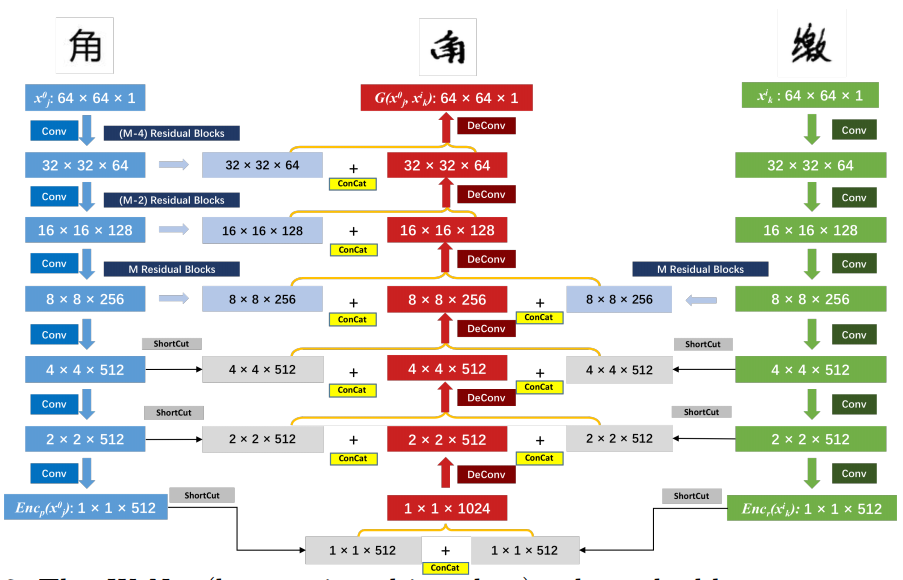

最近受到b站一个视频[1]的启发，想做一套属于自己的字体，但是又不想写好几千个字，为了偷个懒，调研了一下用神经网络合成字体的算法，最终找到一篇名为W-Net的论文：

[W-Net: One-Shot Arbitrary-Style Chinese Character Generation with Deep Neural Networks](https://www.researchgate.net/publication/329007858_W-Net_One-Shot_Arbitrary-Style_Chinese_Character_Generation_with_Deep_Neural_Networks_25th_International_Conference_ICONIP_2018_Siem_Reap_Cambodia_December_13-16_2018_Proceedings_Part_V)

下面介绍一下这篇论文的主要内容：

相关算法
---

论文中提到了三个比较有特点的文献

1 使用RNN根据笔画时序来生成文字[2]；

2 DCFont[3]，将汉字信息分为Content、Style和Category三个部分，使用GAN的思路来训练， 需要700多个字才能生成一套字体；

3 Zi2zi[4]，从pix2pix衍生而来的Encoder+Decoder+Discriminator的结构，同样使用GAN的思路来训练，需要2000多个字才能生成一套字体。

而这片W-net号称只需要一个字就可以生成一套字体，你相信吗？我虽然不太信，但是为了少写几个字，也值得尝试一下。

生成器结构：
---

算法思路简介：
1. 图中左侧的分支用于提取汉字结构信息
2. 图中右侧的分支用于提取字体风格信息 
3. 字体风格特征只选用了较深层网络得到的特征图
4. 采用对抗训练的方式得到与真实汉字相近的图片 

关于判别器结构，文章一笔带过，并未做详细介绍，只提到了判别器中使用了类似[5]中的辅助分类器。

loss函数设计
---

loss函数分为生成损失和判别损失两大部分，每个损失函数都由多个损失加权得到。

下面逐一介绍各个损失项的含义

对抗损失：判别器得到的真伪分类的损失。
汉字分类损失：判别器得到的汉字类别的损失。
字体类别损失：判别器得到的汉字类别损失。
重建损失：包括两个部分，一个是生成的fake_img与real_img之间的L1Loss，另一个是fake_img和real_img分别加入到分类网络得到的多级特征图之间的MSELoss。
常数损失：fake_img和real_img分别通过两个分支得到的向量之间的损失
分支分类损失：在左右分支的输出后面各自添加一个用于分类的全连接层，左分支用于提取汉字结构特征，所以用全连接层对汉字进行分类，右分支用于提取汉字字体风格特征，所以用全连接层对字体进行分类。
梯度惩罚项：模型对于输入求导得到的梯度和，用于防止梯度过大，与梯度剪裁功能相似，但是更加柔和。

论文中得到的生成效果：

为了制作一个字体生成器，我实现了这个算法，地址在：

[W-Net-PyTorch](https://github.com/arctanxy/W-Net-PyTorch)

参考
---

- [1] https://www.bilibili.com/video/BV1St4y1Q71m
- [2] Zhang, X.Y., Yin, F., Zhang, Y.M., Liu, C.L., Bengio, Y.: Drawing and recognizing chinese characters with recurrent neural network. IEEE transactions on pattern analysis and machine intelligence (2017)
- [3] Jiang, Y., Lian, Z., Tang, Y., Xiao, J.: Dcfont: an end-to-end deep chinese font generation system. In: SIGGRAPH Asia 2017 Technical Briefs. p. 22. ACM (2017)
- [4] Tian, Y.: zi2zi: Master chinese calligraphy with conditional adversarial networks.https://github.com/kaonashi-tyc/zi2zi/ (2017)
- [5] Odena, A., Olah, C., Shlens, J.: Conditional image synthesis with auxiliary classifier gans. arXiv preprint arXiv:1610.09585 (2016)