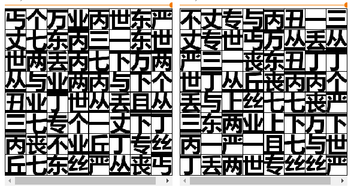
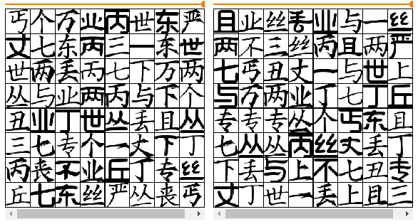
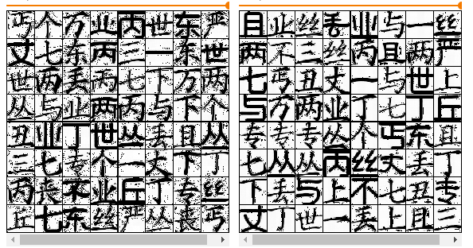

# 基于Wnet的字体生成

最近受到b站一个视频[1]的启发，想做一套属于自己的字体，但是又不想写好几千个字，为了偷个懒，调研了一下用神经网络合成字体的算法，最终找到一篇名为W-Net的论文：

[W-Net: One-Shot Arbitrary-Style Chinese Character Generation with Deep Neural Networks](https://www.researchgate.net/publication/329007858_W-Net_One-Shot_Arbitrary-Style_Chinese_Character_Generation_with_Deep_Neural_Networks_25th_International_Conference_ICONIP_2018_Siem_Reap_Cambodia_December_13-16_2018_Proceedings_Part_V)

下面介绍一下这篇论文的主要内容：

首先是相关算法的介绍：
---

然后是模型结构：
---

算法思路简介：
1. 图中左侧的分支用于提取汉字结构信息
2. 图中右侧的分支用于提取字体风格信息 
3. 字体风格特征只选用了较深层网络得到的特征图
4. 采用对抗训练的方式得到与真实汉字相近的图片 

最后是loss函数设计
---

loss函数分为生成损失和判别损失两大部分，每个损失函数都由多个损失加权得到。

下面逐一介绍各个损失项的含义

真伪损失：判别器得到的真伪分类的损失。
汉字类别损失：判别器得到的汉字类别的损失。
字体类别损失：判别器得到的汉字类别损失。
重建损失：包括两个部分，一个是生成的fake_img与real_img之间的L1Loss，另一个是fake_img和real_img分别加入到分类网络得到的多级特征图之间的MSELoss。
分支损失：在左右分支的输出后面各自添加一个用于分类的全连接层，左分支用于提取汉字结构特征，所以用全连接层对汉字进行分类，右分支用于提取汉字字体风格特征，所以用全连接层对字体进行分类。
梯度惩罚项：模型对于输入求导得到的梯度和，用于防止梯度过大，与梯度剪裁功能相似，但是更加柔和。

论文中得到的生成效果：

为了制作一个字体生成器，我实现了这个算法，地址在：

[W-Net-PyTorch](https://github.com/arctanxy/W-Net-PyTorch)

现阶段的训练结果：

原始字体（黑体加粗）protype
---

目标字体（一个batch里面混合了多种字体）real
---

生成字体 fake
---

与原论文的差别
---

1. Discriminator中没有使用LayerNorm，而是用了BatchNorm
2. loss中没有加梯度惩罚项
3. 没有额外再训练一个VGG分类模型，而是用Discriminator替代

TODO:
---

待添加的一些tricks:

- [x] label smoothing
- [ ] 在G的训练和测试阶段都添加dropout
- [ ] 使用LeaklyReLU替代ReLU
- [ ] 在Discriminator中使用LayerNorm
- [ ] 每个batch中使用同一种字体（据说可以使训练变得更简单）
- [ ] 监控训练中的梯度变化
- [x] 添加梯度惩罚
- [ ] 历史均值
- [ ] 模型推理代码
